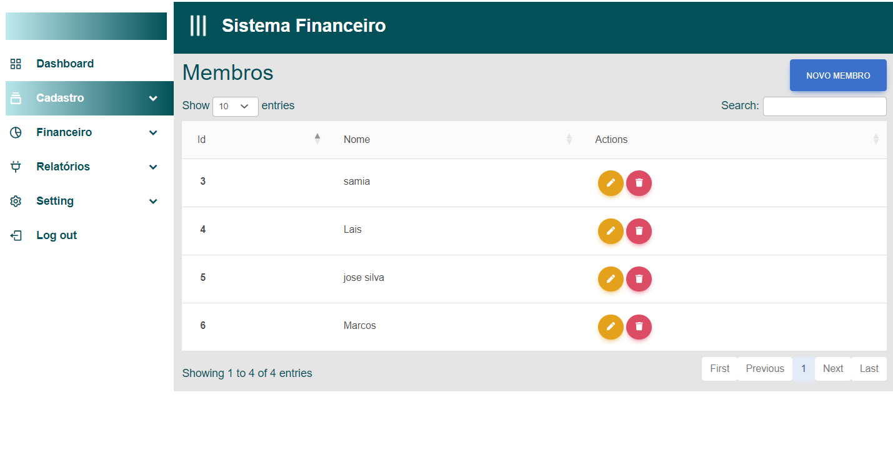

# Planos de Testes de Software

Apresente os cenários de testes utilizados na realização dos testes da sua aplicação. Escolha cenários de testes que demonstrem os requisitos sendo satisfeitos.

Enumere quais cenários de testes foram selecionados para teste. Neste tópico o grupo deve detalhar quais funcionalidades avaliadas, o grupo de usuários que foi escolhido para participar do teste e as ferramentas utilizadas.
 
# Plano de Testes de Software

Pré-requisitos: <a href="2-Especificação do Projeto.md"> Especificação do Projeto</a>, <a href="3-Projeto de Interface.md"> Projeto de Interface</a>

Os requisitos para realização dos testes de software são:
- Aplicativo rodando em emulador de Smartphone. 

Os testes funcionais a serem realizados no aplicativo são descritos a seguir.

Plano de Testes: Funcionalidade de Login
 

|Caso de teste   | CT-01 - Teste de Login com Credenciais Válidas:
|------|-----------------------------------------|
|Requisitos associados | RF-01​​  Usuário fazer login
|Objetivo do teste | O sistema deve permitir o acesso do usuário. 
|Passos | <ol><li> Acessar a página de login. </li> <li> Inserir um nome de usuário e senha válidos. </li> <li> Clicar no botão de login. </li></ol>
|Critérios de Êxito | <ul> <li> Aparecer mensagem de êxito ao realizar login </li> 

 

|Caso de teste   | CT-02 - Teste de Login com Credenciais Inválidas:
|------|-----------------------------------------|
|Requisitos associados | RF-01​​  Usuário fazer login
|Objetivo do teste | O sistema não permitir o acesso com credenciais inválidas. 
|Passos | <ol><li> Acessar a página de login. </li> <li> Inserir um nome de usuário e senha inválidos. </li> <li> Clicar no botão de login. </li></ol>
|Critérios de Êxito | <ul> <li>O sistema deve exibir uma mensagem de erro informando que as credenciais são inválidas. </li> 

 

|Caso de teste   | CT-03 - Teste de recuperação de senha. 
|------|-----------------------------------------|
|Requisitos associados | RF-01​​  Usuário fazer login
|Objetivo do teste | Permitir que o usuário recupere a senha. 
|Passos | <ol><li> Acessar a página de login. </li> <li> Clicar no link "Esqueci minha senha". </li> <li> Inserir o endereço de e-mail associado à conta. </li> <li>Clicar no botão de recuperação de senha. </li></ol>
|Critérios de Êxito | <ul> <li> O sistema deve enviar um e-mail de recuperação de senha para o endereço fornecido e exibir uma mensagem de confirmação. </li> 

 

Plano de Testes: Funcionalidade de Gestão de Contas

|Caso de teste   | CT-04 - Teste de Criação de nova conta: 
|------|-----------------------------------------|
|Requisitos associados | RF-03​​  Gestão de contas. 
|Objetivo do teste | Sistema permitir criação de contas.  
|Passos | <ol><li> Acessar o painel de controle. </li> <li> Clicar no botão "Criar Nova Conta". </li> <li> Preencher os campos obrigatórios. </li> <li>Clicar no botão "Salvar". </li> </ol>
|Critérios de Êxito | <ul> <li>A nova conta deve ser criada com sucesso e aparecer na lista de contas. </li> 

 

|Caso de teste   | CT-05 - Teste de edição de conta existente:  
|------|-----------------------------------------|
|Requisitos associados | RF-03​​  Gestão de contas. 
|Objetivo do teste | Sistema permitir editar contas. 
|Passos | <ol><li> Acessar o painel de controle. </li> <li> Selecionar uma conta existente na lista. </li> <li> Clicar no botão "Editar". </li> <li>Realizar alterações nos campos desejados. </li><li> Clicar no botão "Salvar".</li> </ol>
|Critérios de Êxito | <ul> <li>As alterações na conta devem ser salvas com sucesso. </li> 
 

|Caso de teste   | CT-06 -Teste de Visualização de Detalhes da Conta: 
|------|-----------------------------------------|
|Requisitos associados | RF-03​​  Gestão de contas. 
|Objetivo do teste | Sistema permitir visualizar detalhes das contas. 
|Passos | <ol><li> Acessar o painel de controle. </li> <li> Selecionar uma conta existente na lista. </li> <li> Clicar no botão "Visualizar Detalhes". </li></ol>
|Critérios de Êxito | <ul> <li>Os detalhes da conta devem ser exibidos de forma clara e precisa.</li> 

 

|Caso de teste   | CT-07 -Teste de exclusão de conta:
|------|-----------------------------------------|
|Requisitos associados | RF-03​​  Gestão de contas. 
|Objetivo do teste | Sistema permitir excluir contas. 
|Passos | <ol><li> Acessar o painel de controle. </li> <li> Selecionar uma conta existente na lista. </li> <li> Clicar no botão "Excluir". </li> <li> Confirmar a exclusão quando solicitado. </li></ol>
|Critérios de Êxito | <ul> <li>A conta selecionada deve ser excluída com sucesso.</li> 

 

|Caso de teste   | CT-08 Teste de Validação de Campos Obrigatórios:
|------|-----------------------------------------|
|Requisitos associados | RF-03​​  Gestão de contas. 
|Objetivo do teste | Validação de campos obrigatórios. 
|Passos | <ol><li> Acessar o painel de controle. </li> <li> Clicar no botão "Criar Nova Conta". </li> <li> Deixar campos obrigatórios em branco. </li> <li> Clicar no botão "Salvar". </li></ol>
|Critérios de Êxito | <ul> <li>O sistema deve exibir mensagens de erro indicando os campos obrigatórios que não foram preenchidos</li> 

 

|Caso de teste   | CT-09 Teste de filtro e pesquisa de contas: 
|------|-----------------------------------------|
|Requisitos associados | RF-03​​  Gestão de contas. 
|Objetivo do teste | Filtrar contas existentes. 
|Passos | <ol><li> Acessar o painel de controle. </li> <li> Utilizar os filtros de pesquisa para encontrar uma conta específica. </li></ol>
|Critérios de Êxito | <ul> <li>O sistema deve exibir a lista de contas de acordo com os critérios de pesquisa especificados.</li> 

 

|Caso de teste   | CT-10 - Teste de Criação de novo membro: 
|------|-----------------------------------------|
|Requisitos associados | RF-03​​  Gestão de membros. 
|Objetivo do teste | Sistema permitir criação de membros.  
|Passos | <ol><li> Acessar o painel de controle. </li> <li> Clicar no botão "Criar Adiciomas Novo Membro". </li> <li> Preencher os campos obrigatórios. </li> <li>Clicar no botão "Salvar". </li> </ol>
|Critérios de Êxito | <ul> <li>A novo membro deve ser criada com sucesso e aparecer na lista de membros. </li> </ol>
|Passos no Swagger | <ul> <li>Após preenchimento do Jason novo membro deve ser criada com sucesso apresentado o código 201. </li> 

 

|Caso de teste   | CT-11 Teste de filtro e pesquisa de menbros: 
|------|-----------------------------------------|
|Requisitos associados | RF-03​​  Gestão de membros. 
|Objetivo do teste | Sistema permitir editar membros. 
|Passos | <ol><li> Acessar o painel de controle. </li> <li> Selecionar uma membro existente na lista. </li> <li> Clicar no botão "Editar". </li> <li>Realizar alterações nos campos desejados. </li><li> Clicar no botão "Salvar".</li> </ol>
|Critérios de Êxito | <ul> <li>As alterações no membro devem ser salvas com sucesso. </li> 

 

|Caso de teste   | CT-12 -Teste de exclusão de membros:
|------|-----------------------------------------|
|Requisitos associados | RF-03​​  Gestão de membros. 
|Objetivo do teste | Sistema permitir excluir membros. 
|Passos | <ol><li> Acessar o painel de controle. </li> <li> Selecionar um membro existente na lista. </li> <li> Clicar no botão "Excluir". </li> <li> Confirmar a exclusão quando solicitado. </li></ol>
|Critérios de Êxito | <ul> <li>O membro selecionada deve ser excluída com sucesso.</li> 

  

|Caso de teste   | CT-13 - Teste de Criação de novo fornecedor: 
|------|-----------------------------------------|
|Requisitos associados | RF-03​​  Gestão de fornecedores. 
|Objetivo do teste | Sistema permitir criação de fornecedores.  
|Passos | <ol><li> Acessar o painel de controle. </li> <li> Clicar no botão "Criar Adiciomas Novo Fornecedor". </li> <li> Preencher os campos obrigatórios. </li> <li>Clicar no botão "Salvar". </li> </ol>
|Critérios de Êxito | <ul> <li>A novo fornecedor deve ser criada com sucesso e aparecer na lista de fornecedores. </li> </ol>
|Passos no Swagger | <ul> <li>Após preenchimento do Jason novo fornecedor deve ser criada com sucesso apresentado o código 201. </li> 

 

|Caso de teste   | CT-14 Teste de filtro e pesquisa de fornecedores: 
|------|-----------------------------------------|
|Requisitos associados | RF-03​​  Gestão de fornecedores. 
|Objetivo do teste | Sistema permitir editar fornecedores. 
|Passos | <ol><li> Acessar o painel de controle. </li> <li> Selecionar uma fornecedor existente na lista. </li> <li> Clicar no botão "Editar". </li> <li>Realizar alterações nos campos desejados. </li><li> Clicar no botão "Salvar".</li> </ol>
|Critérios de Êxito | <ul> <li>As alterações no fornecedor devem ser salvas com sucesso. </li> 

 

|Caso de teste   | CT-15 -Teste de exclusão de fornecedores:
|------|-----------------------------------------|
|Requisitos associados | RF-03​​  Gestão de fornecedores. 
|Objetivo do teste | Sistema permitir excluir fornecedores. 
|Passos | <ol><li> Acessar o painel de controle. </li> <li> Selecionar um fornecedor existente na lista. </li> <li> Clicar no botão "Excluir". </li> <li> Confirmar a exclusão quando solicitado. </li></ol>
|Critérios de Êxito | <ul> <li>O fornecedor selecionada deve ser excluída com sucesso.</li> 

 

# Evidências de Testes de Software

# Evidências de Testes de Software
### CT-01 - CT-01 - Teste de Login com Credenciais Válidas

### CT-02 - Teste de Login com Credenciais Inválidas

### CT-04 - Teste de Criação de nova conta

### CT-05 - Teste de edição de conta existente

### CT-06 - Teste de criação de novo membro 

### CT-06 - Teste de criação de novo membro (Swagger) 

### CT-07 - Teste de edição de membro existente

### CT-08 - Teste de exclusão de membro existente

### CT-09 - Teste de criação de novo fornecedor 

### CT-09 - Teste de criação de novo fornecedor (Swagger) 

### CT-10 - Teste de edição de fornecedor existente

### CT-11 - Teste de exclusão de fornecedor existente

